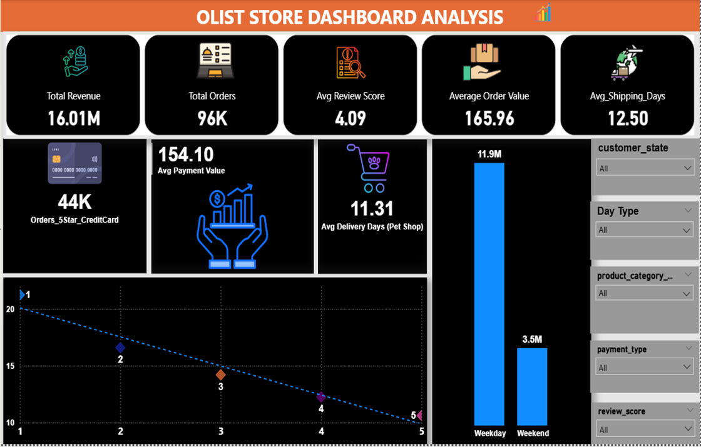
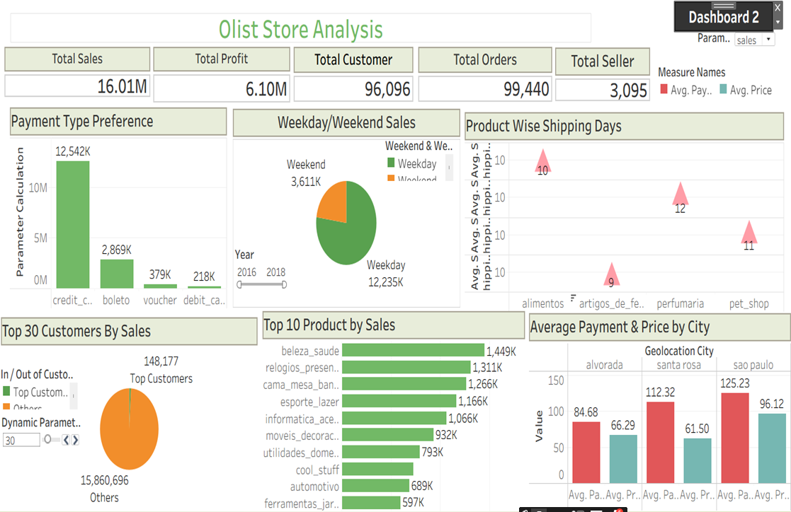
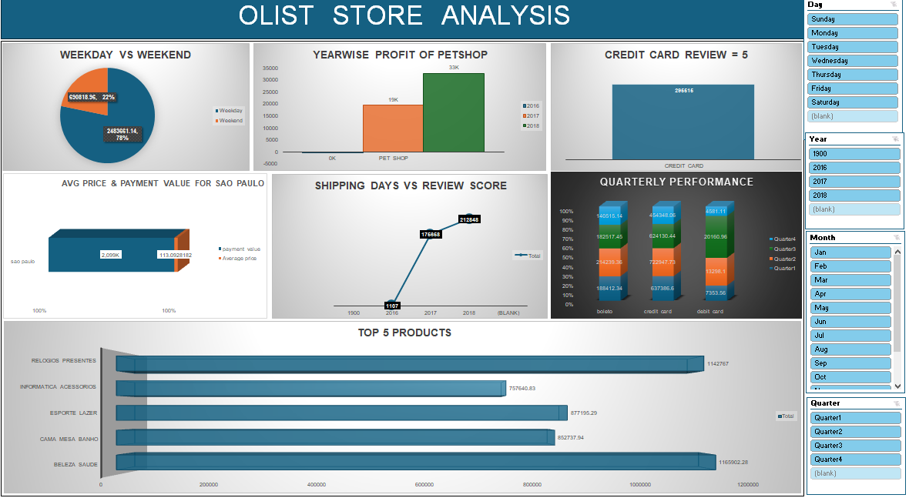

# Olist E-Commerce Marketplace Analysis 🛒

## 📌 Project Overview & Business Case
This project analyzes over **100k real, anonymized marketplace transactions** from Olist Store in Brazil. As a data analyst case study, my objective is to evaluate operational performance, identify logistics bottlenecks, break down consumer payment behaviors, and measure how fulfillment speeds directly impact customer review scores.

---

## 📊 Core Business KPIs Addressed
The project delivers data-driven answers to these 5 operational goals:
1. **Fulfillment Habit Breakdown:** Weekday vs. Weekend order volume and payment statistics.
2. **High-Value Checkout Segment:** Total count of perfect 5-star review orders processed via Credit Cards.
3. **Product Category Deep-Dive:** Average delivery timeline calculation specifically for the `pet_shop` category.
4. **Regional Financial Weight:** Average item prices and total client payment values originating from São Paulo city.
5. **Operational Correlation Matrix:** Statistical evaluation of customer shipping day lengths vs. final review scores.

---

## 🛠️ Technical Stack Used
* **Database Layer:** MySQL 8.0 / PostgreSQL (Schema mapping, multi-table JOIN optimization, aggregations).
* **Business Intelligence & ETL:** Microsoft Excel, Power BI (DAX metrics design), and Tableau Desktop (Calculated Fields mapping).
* **Version Control:** GitHub.

---

## 🔍 Data Architecture & Model Verification

> 📁 **Repository Artifacts Note:** High-resolution presentation layouts are detailed below. To inspect the live data models, entity relationships, and calculation mechanics that power these visuals, you can download the raw working workbooks directly via these secure download vectors:
> * 📊 [Download Raw Power BI Model (.pbix)](https://drive.google.com/file/d/1ZxFN5fvwfAjXYvkA1QlPddwk_DoIxc4x/view?usp=sharing)
> * 🎨 [Download Raw Tableau Packaged Workbook (.twbx)](https://drive.google.com/file/d/1BeimUKzn8RQPC3QiVv-P6cKQ-7LpE0gu/view?usp=sharing)
> * 📈 [Download Raw Excel Source Model (.xlsx)](https://docs.google.com/spreadsheets/d/1sd0Ymamb54IBKNuP7PaPsJpfZHxf6ie_/edit?usp=sharing&ouid=101703711638777030705&rtpof=true&sd=true)

---

## 🖼️ Business Intelligence Dashboards (Multi-Tool Implementation)

> 💡 Project Delivery Note: High-resolution operational layout previews are embedded below for immediate documentation review. The raw source workbooks (.pbix, .xlsx, .twbx) are accessible directly within the /Dashboards repository directory to allow full auditing of data connections, model architectures, and backend computations

### 1. Power BI Executive Market Overview

  

* **Advanced Data Modeling:** Formed a streamlined schema connecting transactional fact logs to isolated dimension attributes to handle over **16.01M in Total Revenue** and **96K Total Orders** seamlessly.
* **Granular KPI Engineering:** Developed precise backend metrics utilizing custom conditional logic to pull high-priority operational insights:
  * **Core Retail Performance:** Surfaced an **Average Order Value (AOV) of \$165.96** and isolated an **Average Shipping Window of 12.50 Days**.
  * **Targeted Segmentation:** Extracted complex conditional metrics, pinpointing that **44K Orders** achieved a perfect 5-star rating specifically via credit card payments.
* **Interactive Filter Panes:** Programmed unified right-aligned slicer trees for `customer_state`, `Day Type`, and `payment_type` to dynamically slice the delivery trends line chart.

---

### 2. Tableau Operational Deep-Dive & Parameter Control

  

* **Dynamic Parameter & Measure Swapping:** Configured a parameter selection control panel (`Dashboard 2 / Param..`) allowing leadership to instantly toggle the entire visual canvas focus metrics between distinct sales variants.
* **Cross-Tab Level of Detail (LOD) Expressions:** Built synchronized top summary tiles capturing macroscopic indicators (**16.01M Sales, 6.10M Profit, 96K Customers**) that remain anchored regardless of nested sheet actions.
* **Geospatial & Logistical Mapping:** Leveraged custom fields to map `Average Payment & Price by City` (e.g., contrasting Sao Paulo at \$125.23 vs. Santa Rosa at \$112.32) alongside an analytics scatter chart mapping product-specific shipping distributions.

---

### 3. Excel Core Operations & Interactive Slicer Panel

  

* **Power Query Data Pipeline:** Ingested messy transactional tables to cleanly group temporal segments, enabling a comprehensive **Weekday vs. Weekend sales** split showing Weekdays leading at **78% (\$24.8M)**.
* **Multi-Layered Pivot Calculations:** Synthesized complex cross-tabulations to map multi-year growth curves (2016-2018), isolating category-specific profiles like the *Yearwise Profit of Petshops* scaling to **\$33K** in its peak year.
* **Synchronized Report Slicers:** Engineered a multi-slicer layout panel control (Day, Year, Month, Quarter) that broadcasts global filters across distinct pivot tables to reveal the *Top 5 Products* by overall volume.

---

## 💡 Analytical Insights & Strategic Recommendations
* **Logistics Trajectory vs. Sentiment:** The data confirms a sharp decline in perfect 5-star ratings when delivery timelines exceed 7 business days. Establishing local delivery hubs in underperforming regional states is recommended to compress the 12.50-day average delivery window.
* **Credit Dependency Patterns:** High-ticket product segments leverage credit card payment installments heavily on weekdays (accounting for 78% of total volume), whereas smaller basket sizes lean on bank vouchers (`boleto`) during weekends. Launching targeted credit card promotions will help maximize high-value orders.
* **São Paulo Dominance:** São Paulo represents the highest concentration of gross merchandise value (GMV) with an average transaction value of \$125.23, making it the primary region to optimize inventory fulfillment to prevent seasonal stockouts.
